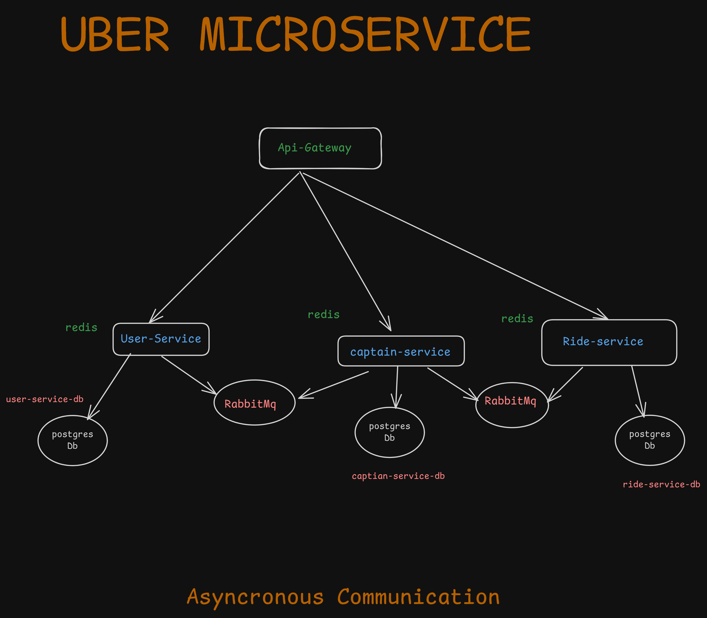

# Uber-like Microservices Architecture

A scalable Node.js microservices-based ride-sharing platform using Express, RabbitMQ, PostgreSQL, and AWS infrastructure.



## System Architecture

### Microservices
- **API Gateway**: An Express-based gateway for routing and authentication.
- **User Service**: Handles user management and authentication.
- **Ride Service**: Manages ride requests and driver matching.
- **Capitain Service**: captian service management 

### Tech Stack
- **Runtime**: Node.js
- **Framework**: Express.js
- **Message Broker**: RabbitMQ
- **Database**: PostgreSQL
- **Caching**: Redis
- **Containerization**: Docker & Docker Compose
- **Cloud**: AWS (ECS, RDS, ElastiCache)
- **API Documentation**: Swagger/OpenAPI

## Prerequisites

Ensure you have the following installed and configured:

- **Node.js** (v18 or higher)
- **Docker** and **Docker Compose**
- **AWS CLI** (configured)
- **PostgreSQL**
- **RabbitMQ**

## Quick Start

### Clone the Repository

Copy and paste the following command to clone the repository:

```bash
git clone https://github.com/Ashisharjun12/uber-microservice.git
```

Use Docker  for pull PostgreSQL and Redis Images

```bash
docker-compose up -d
```

for down docker composer

```bash
docker-compose down 
```


